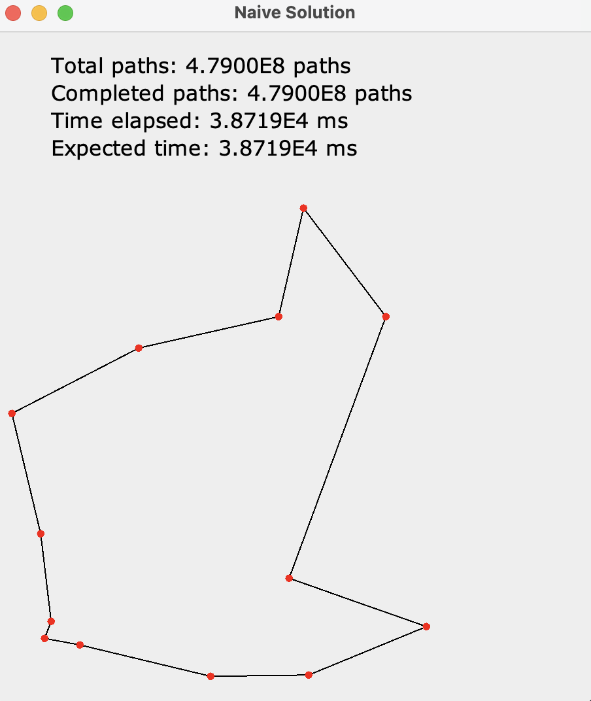
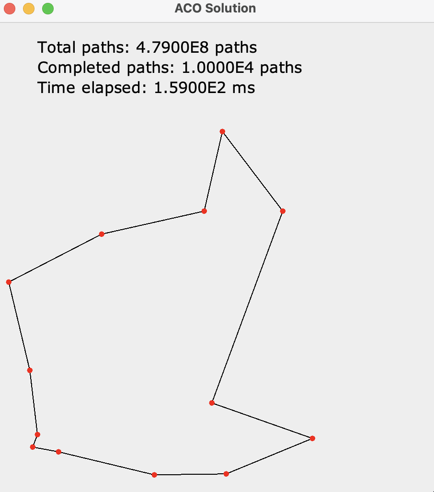

# Ant Colony Optimzation for Traveling Salesman

## Summary
Java GUI Program to simulate both a naive and ant colony optimized solution to the traveling salesman problem. A set of points in 2d space are randomly generated and different paths are tested. The best path is painted onto the screen.

### Naive
The naive algorithm is a brute force search for all possible paths. Therefore, it runs in about O(n!) time, which is incredibly slow!

### ACO
The Ant Colony Optimized approach is an algorithm inspired by how ants forage for food. Ants will release pheromones to
indicate to other ants which directions contain better resources. In this algorithm, ants will take random paths based on the strength of
pheromones. Because variation is introduced, ants will randomly explore alternative paths, potentially finding better paths. Stronger
paths are rewarded and weaker paths are diminished. Eventually, the ants will converge on a **local** minimum (note that the algorithm
does not guarantee finding the most optimal path).

<hr/>

## Compile and Run
Compile
```bash
javac -cp src -d out src/*.java
```
Then run using <code>java</code>:
```bash
java -cp out src.Main [-flags]
```

<hr/>

## Runtime flags
* <code>--naive</code>: Runs the brute force algorithm on a set of random points (generated by a seed).
* <code>--aco</code>: Runs the ACO algorithm on a set of random points (generated by a seed)
* <code>-n=?</code>: How many poitns in the graph
* <code>-s=?</code>: The random seed that generates how many points to run. Defaults to random.
* <code>-a=?</code>: How many ants will run in the aco algorithm. Ignored if <code>--aco</code> flag is not also specified
* <code>-i=?</code>: How many generations of ants will run in the ACO algorithm. Ignored if <code>--aco</code> flag is not also specified

## Comparison
In both simulations, we run the code on 12 points in the graph. The naive approach needs to check almost 4.8E8 different paths
which takes 38.7 seconds.
In the ant colony optimized approach (which we run with 100 ants and 100 generations) takes only 159 ms and needs to check only 1E4 paths.
This means that the algorithm checks only 0.00208% of the paths and takes only 0.04108% of the time (the disparity is likely due to rendering costs).

What's particularly interesting is the fact that both approaches converged on the same path (which is not guaranteed by the algorithm but is fairly
consistent).


